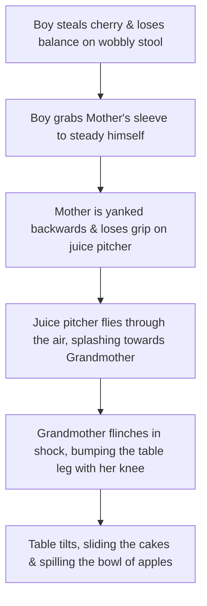

# Cognitive Assessment Image 4 Metadata

This document contains the prompt, design notes, and description of the fourth cognitive assessment scene image generated for picture description tasks. This scene is built specifically to test a participant's ability to infer **interconnected relationships and causal loops** between characters, rather than observing isolated events.

## Image Reference
* **Filename:** [cognitive_assessment_scene_4.png](file:///Users/aidasaglinskas/Desktop/ANDSpeak-prompt-images/cognitive_assessment_scene_4.png)
* **Style:** Black and white line drawing (clinical outline art style)

---

## Generation Prompt
```text
A clean black and white line drawing, clinical assessment style (no colors, no grayscale shading, clean outlines, white background). A family is experiencing an interconnected kitchen disaster around a dining table. A young boy stands on a wobbly wooden stool, reaching for a cherry on top of a tall layered cake on the table. The stool is tipping over, and as he falls, he grabs the sleeve of his mother. The mother, who was walking by carrying a large pitcher of juice, is pulled off balance by the boy; she drops the pitcher, sending a stream of juice splashing toward the grandmother. The grandmother, sitting at the table slicing a loaf of bread, flinches back in shock from the splash, knocking the table leg with her knee. This tilts the table, causing the cake to slide off the edge toward the falling boy and a bowl of apples to spill. High contrast, simple cartoon outline art, very clear characters and actions.
```

---

## Scene Description and Causal Loops (Clinical Targets)

Unlike previous scenes where characters acted independently, this picture requires the viewer to trace a single, continuous chain of cause-and-effect that involves all three characters. 

### 1. The Interlinked Chain Reaction (The Core Narrative)
To successfully describe the picture, a subject should ideally reconstruct the following sequence:



### 2. Specific Clinical Indicators (What to listen for)
* **The Boy's Action:** Reaching for the cherry on top of the large cake while falling off the tilting stool.
* **The Sleeve Grab:** The physical link between the boy and the mother (the boy's left hand is pulling the fabric of the mother's sleeve).
* **The Mother's Reaction:** Looking back in alarm as she is pulled, holding a pitcher in one hand while another pitcher (or the dropped pitcher) flies through the air.
* **The Flying Pitcher & Splash:** The trajectory of the spilled liquid moving directly toward the grandmother.
* **The Grandmother's Reaction:** Sitting in a chair, cutting a loaf of bread, with wide eyes and an open mouth (shocked expression) due to the incoming liquid.
* **The Tilting Table & Falling Items:**
  - A smaller cake is sliding/falling off the table.
  - A bowl of apples is tipping over, with apples falling through the air and landing on the floor.
  - The table legs are tilted, indicating it is actively tipping or moving.

### 3. Key Relationships to Infer
* **Generational Relationship:** Grandchild (boy), mother, and grandmother (older woman) all interacting in a shared kitchen/dining space.
* **Mutual Influence:** None of the actions in the scene are independent; the child's action directly compromises the mother's stability, which directly compromises the grandmother's safety, which in turn causes the table to tilt and ruin the very food they were preparing/stealing.
