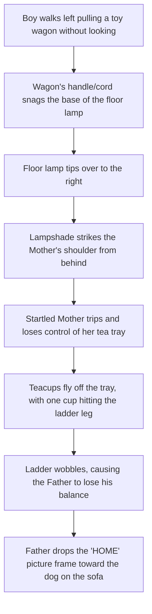

# Cognitive Assessment Image 5 Metadata

This document contains the prompt, design notes, and description of the fifth cognitive assessment scene image generated for picture description tasks. This scene is built to evaluate a participant's capacity to trace a **complex, multi-stage chain-reaction** where every character's action directly affects the next.

## Image Reference
* **Filename:** [cognitive_assessment_scene_5.png](file:///Users/aidasaglinskas/Desktop/ANDSpeak-prompt-images/cognitive_assessment_scene_5.png)
* **Style:** Black and white line drawing (clinical outline art style)

---

## Generation Prompt
```text
A clean black and white line drawing, clinical assessment style (no colors, no grayscale shading, clean outlines, white background). A family is experiencing an interconnected chain-reaction mishap in a living room. In the center, a father on a stepladder is hanging a framed picture on the wall. To the left, a young boy pulls a toy wagon while looking backwards, catching the wheel of the wagon on the cord of a tall floor lamp. The lamp is tipping over, and its lampshade is about to strike the shoulder of a mother who is carrying a tray of teacups. The startled mother is dropping the tray, sending teacups flying through the air; one cup is about to hit the leg of the father's ladder. The ladder is wobbling, causing the picture frame to slip from the father's hands, about to fall onto a startled dog resting on the sofa below. Simple line art, high contrast, clean outlines.
```

---

## Scene Description and Causal Chains (Clinical Targets)

This picture features a sequence of physically coupled actions that occur in a rapid chain reaction.

### 1. The Interlinked Chain Reaction (The Core Narrative)
To successfully describe the picture, a subject should ideally reconstruct the following sequence:



### 2. Specific Clinical Indicators (What to listen for)
* **The Boy's Negligence:** Pulling a toy wagon while looking backwards or looking distracted, dragging the wagon into the lamp cord.
* **The Snag:** The physical connection between the toy wagon and the floor lamp.
* **The Falling Lamp:** The tipping motion of the floor lamp and its trajectory towards the mother.
* **The Mother's Spill:** Holding a tray of tea, with teacups and a teapot flying through the air. One cup is splashing tea as it flies.
* **The Ladder Impact:** A teacup hitting the leg/frame of the ladder.
* **The Father's Fall:** The father balancing precariously on the shaking ladder, holding one picture frame on the wall while dropping another.
* **The Frame & The Dog:** The dropped picture frame (labeled **"HOME"**) falling directly toward the dog on the sofa.
* **The Dog's Alarm:** The dog sitting on the sofa looking up at the falling frame with a startled expression.

### 3. Key Relationships to Infer
* **Environmental/Causal Links:** The chain reaction demonstrates a complete causal link starting from a simple distraction (the boy pulling a wagon) to a dramatic sequence affecting everyone in the room. 
* **Shared Space Dynamics:** Highlighting how family members' actions in the same living room are physically and immediately connected.
